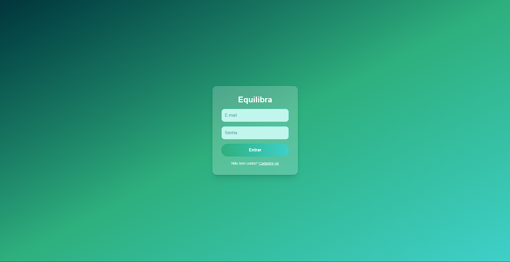
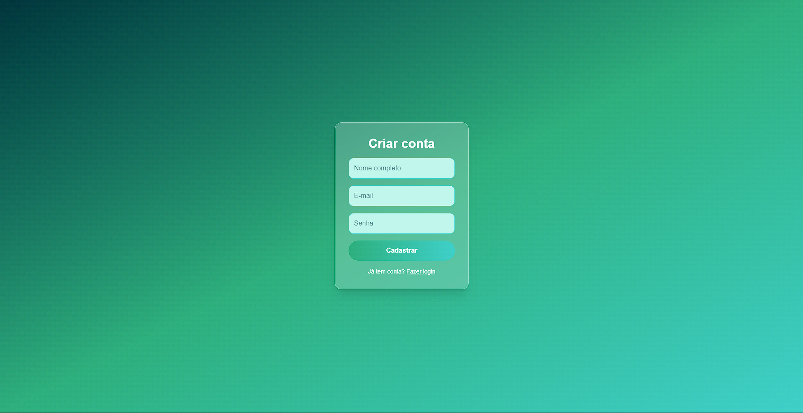
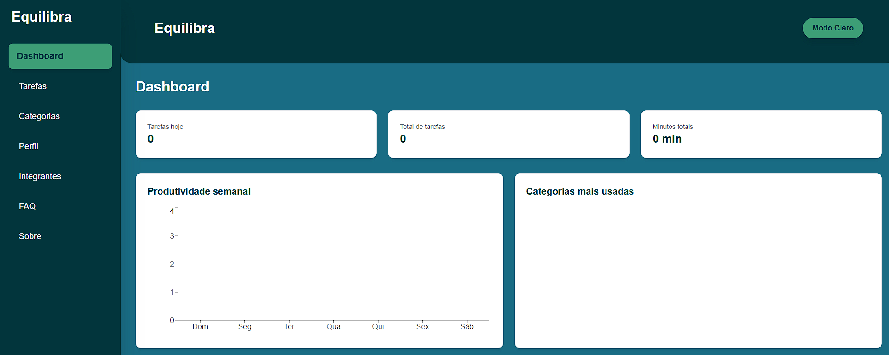
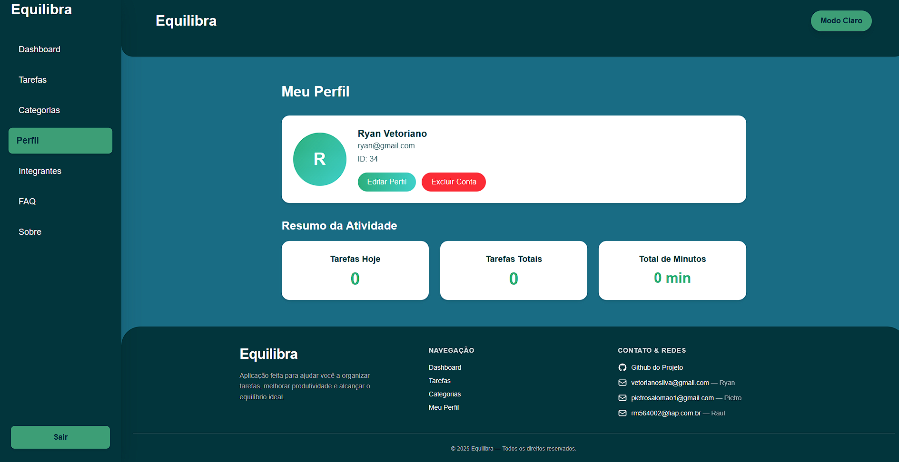

# ⚖️ Equilibra: Gestão Inteligente de Tarefas e Categorias

## 🎯 1. Título e Descrição

**Equilibra** é uma plataforma abrangente, desenvolvida para ajudar usuários a conquistar o balanço ideal entre vida pessoal e profissional através de uma gestão de tarefas simplificada e eficiente.

Nosso objetivo é fornecer uma ferramenta intuitiva, simples e responsiva que permite a qualquer pessoa organizar suas atividades diárias e categorizar seus compromissos, promovendo foco, produtividade e bem-estar.

## 🟢 2. Status do Projeto

✅ Projeto Concluído e Entregue (Global Solution 2025/2)

## 📖 3. Sumário

* [1. Título e Descrição](#-1-título-e-descrição)
* [2. Status do Projeto](#-2-status-do-projeto)
* [3. Sumário](#-3-sumário)
* [4. Sobre o Projeto](#-4-sobre-o-projeto)
* [5. Tecnologias Utilizadas](#-5-tecnologias-utilizadas)
* [6. Instalação](#-6-instalação)
* [7. Como Usar](#-7-como-usar)
* [8. Estrutura de Pastas](#-8-estrutura-de-pastas)
* [9. Rotas e Endpoints Principais](#-9-rotas-e-endpoints-principais)
* [10. Autores e Créditos](#-10-autores-e-créditos)
* [11. Screenshots / Demonstração](#-11-screenshots--demonstração)
* [12. Contato](#-12-contato)

## ✨ 4. Sobre o Projeto

O **Equilibra** foi construído com foco na experiência do usuário e na arquitetura de software robusta, utilizando o conceito de **CRUD** (Create, Read, Update, Delete) em suas entidades principais (Tarefas e Categorias).

### Funcionalidades Implementadas:

* ✅ **Gestão de Tarefas:** Cadastro, edição e exclusão de tarefas.
* ✅ **Gestão de Categorias:** Criação, modificação e remoção de categorias personalizadas (Ex: Pessoal, Trabalho, Estudos).
* ✅ **Visualização Filtrada:** Exibição de tarefas por categoria.
* ✅ **Perfil do Usuário:** Página dedicada para edição de informações de conta.
* ✅ **Tema Dinâmico:** Suporte a tema claro e escuro, gerenciado via Context API do React.
* ✅ **Responsividade:** Interface adaptada para uso em dispositivos móveis e desktop.

## 🛠️ 5. Tecnologias Utilizadas

| Camada | Tecnologia | Descrição |
| :--- | :--- | :--- |
| **Front-End** | **React + Vite** | Biblioteca JavaScript para construção da interface de usuário. |
| **Linguagem** | **TypeScript** | Superset tipado para desenvolvimento seguro e escalável. |
| **Estilização** | **TailwindCSS** | Framework *utility-first* para design rápido e responsivo. |
| **Rotas** | **React Router DOM** | Gerenciamento de navegação entre as páginas do Front-End. |
| **Comunicação** | **Fetch API** | Consumo dos serviços da API Back-End. |
| **Back-End** | **Java + Quarkus** | Desenvolvimento da API RESTful de alta performance. |

## ⚙️ 6. Instalação

Para executar o projeto localmente, siga os passos abaixo:

### Pré-requisitos
* Node.js (versão LTS)
* npm ou yarn
* Java Development Kit (JDK) 17+
* Maven ou Gradle (para o Back-End Quarkus)

### Front-End (React + Vite)
1.  **Clone o repositório:**
    ```bash
    git clone [https://github.com/ryanvetoriano/Equilibra.git](https://github.com/ryanvetoriano/Equilibra.git)
    cd Equilibra
    ```
2.  **Instale as dependências:**
    ```bash
    npm install
    # ou yarn install
    ```
3.  **Execute a aplicação:**
    ```bash
    npm run dev
    # ou yarn dev
    ```
    O Front-End estará acessível em `http://localhost:5173` (ou porta similar).

### Back-End (Java + Quarkus)
*(Assumindo que o código Back-End esteja em um subdiretório, por exemplo, `/equilibrio`)*
1.  **Navegue até a pasta do Back-End:**
    ```bash
    cd equilibrio 
    ```
2.  **Execute o servidor em modo de desenvolvimento:**
    ```bash
    ./mvnw quarkus:dev
    # ou use seu IDE (IntelliJ, VS Code) para rodar o projeto.
    ```
    O Back-End estará acessível em `http://localhost:8080`.

## 🚀 7. Como Usar

O **Equilibra** está hospedado e disponível para uso imediato.

| Recurso | Endereço |
| :--- | :--- |
| **Aplicação Web (Vercel)** | [https://equilibra-beta.vercel.app/](https://equilibra-beta.vercel.app/) |
| **Repositório GitHub** | [https://github.com/ryanvetoriano/Equilibra](https://github.com/ryanvetoriano/Equilibra) |

## 🗂️ 8. Estrutura de Pastas

A organização do projeto Front-End segue uma estrutura clara para facilitar a manutenção e escalabilidade:

/src

/components → componentes reutilizáveis (Botões, Formulários, Cards, Tabelas)

/pages → páginas principais do sistema (Login, Cadastro, Home, Tarefas, Categorias, Perfil do Usuário, Integrantes, Sobre e FAQ)

/context → gerenciamento do tema claro/escuro

/types → tipagem das entidades (TipoTarefa, TipoCategoria, TipoUser)

/public/img → imagens e ícones utilizados

/layout → Controla o layout da aplicação

globals.css → Estilização da aplicação

App.tsx → renderização principal da aplicação

main.tsx → gerenciamento de rotas

## 🗺️ 9. Rotas e Endpoints Principais

### Rotas Front-End (React Router DOM)
| Rota | Descrição |
| :--- | :--- |
| `/usuarios` | Acesso àos usuários (Usado po login e cadastro). |
| `/tarefas` | Visualização e gerenciamento completo de tarefas. |
| `/categorias` | Gerenciamento de categorias. |

## 👥 10. Autores e Créditos

Este projeto foi desenvolvido como parte da Global Solution da turma **1TDSPF** da FIAP.

| Nome | RM | Turma | LinkedIn | GitHub |
| :--- | :--- | :--- | :--- | :--- |
| **Ryan Vetoriano** | RM 565667 | 1TDSPF | [Link do LinkedIn](https://www.linkedin.com/in/ryanvetoriano/) | [Link do GitHub](https://github.com/ryanvetoriano) |
| **Raul Rezende** | RM 564002 | 1TDSPF | [Link do LinkedIn](https://www.linkedin.com/in/raul-iemini/) | [Link do GitHub](https://github.com/Raul-Rezende) |
| **Pietro Donella** | RM 561722 | 1TDSPF | [Link do LinkedIn](https://www.linkedin.com/in/pietro-donella-salom%C3%A3o-2a3502367/) | [Link do GitHub](https://github.com/PietroDonella) |

## 🎬 11. Screenshots / Demonstração

### Demonstração em Vídeo
Assista ao vídeo de demonstração completo das funcionalidades e do Pitch do projeto:

* **Link da Demonstração:** [Clique para assistir](https://youtu.be/dnMmHNYHUPA)

## 🎬 11. Screenshots / Demonstração

### Demonstração em Vídeo
Assista ao vídeo de demonstração completo das funcionalidades e do Pitch do projeto:

* **Link da Demonstração:** [Clique para assistir](https://youtu.be/dnMmHNYHUPA)

### Screenshots
Aqui estão as principais telas da aplicação **Equilibra**:

#### Tela de Login


#### Tela de Cadastro


#### Tela Inicial / Home


#### Tela de Perfil do Usuário


## ✉️ 12. Contato

Para dúvidas, sugestões ou colaborações, utilize o [Issue Tracker deste repositório](https://github.com/ryanvetoriano/Equilibra/issues) ou entre em contato com os membros da equipe.